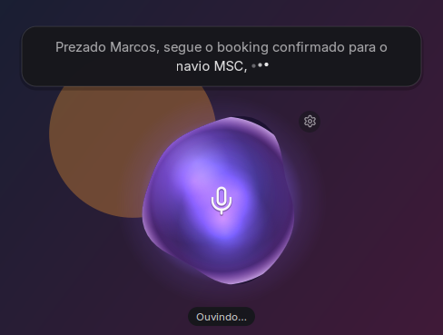
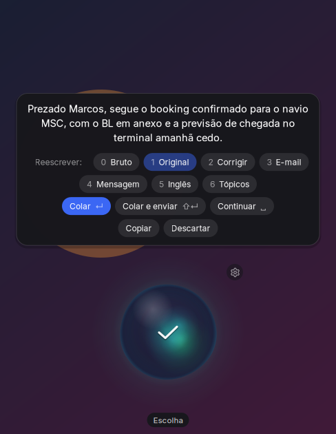
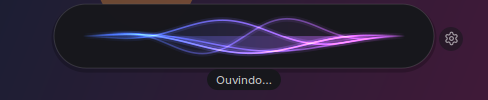
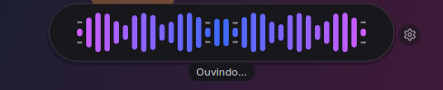
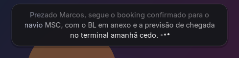
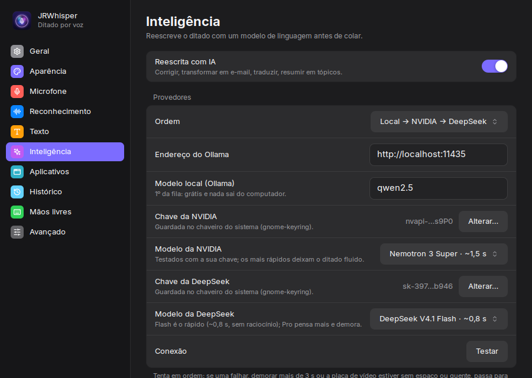
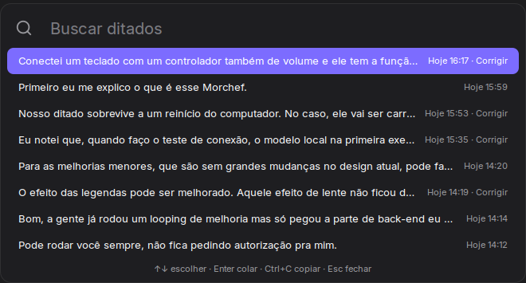
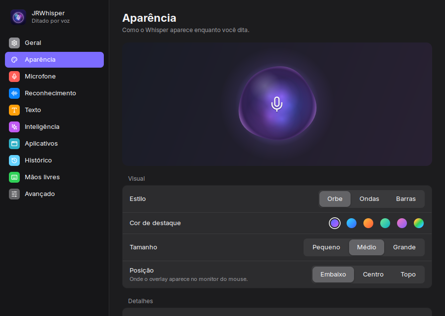

# JRWhisperLinux

> Fale. O texto aparece onde você está. Ditado por voz para Linux que roda na sua máquina.

<p align="center">
  <a href="https://jrwhisper.jasonrock.dev"></a>
  <a href="LICENSE"></a>
  <a href="docs/licenses.md"></a>
  
  
</p>

<p align="center"></p>

Aperte o atalho, fale e aperte de novo. O Whisper transcreve na sua GPU, o texto é formatado (e, se você quiser, reescrito por IA) e colado no campo onde está o cursor. A voz não sai do computador.

**Sumário:** [Instalação](#instalação) · [Uso](#uso) · [Atalhos](#atalhos) · [Recursos](#recursos) · [Ajustes](#ajustes) · [Linha de comando](#linha-de-comando) · [Privacidade](#privacidade) · [Arquivos e serviços](#arquivos-e-serviços) · [Problemas comuns](#problemas-comuns) · [Desenvolvimento](#desenvolvimento) · [Licenças](#licenças)

Documentação complementar: [arquitetura](docs/architecture.md) · [todas as configurações](docs/configuration.md) · [changelog](docs/changelog.md) · [auditoria de licenças](docs/licenses.md)

---

## Instalação

```bash
curl -fsSL https://jrwhisper.jasonrock.dev/install.sh | bash
```

Ou a partir do repositório:

```bash
git clone https://github.com/jaisonrocha-ship-it/jrwhisperlinux.git
cd jrwhisperlinux
bash scripts/install.sh
```

O instalador (Debian, Ubuntu e Mint):

| Etapa | O que faz |
|---|---|
| Pacotes do sistema | GTK3, librsvg, AT-SPI, `pulseaudio-utils`, `xdotool`/`xclip` (X11), `wtype`/`wl-clipboard` (Wayland), `ffmpeg`, `libsecret-tools`, `dconf-cli` |
| Ambiente Python | venv em `~/.local/share/dictation-venv` com `faster-whisper` (reaproveitado numa atualização) |
| Comando `dictate` | Lançador em `~/.local/bin/dictate` que acha o repositório mesmo se ele for movido |
| Configuração | `~/.config/dictate/config.json` (mantém a existente) e o modelo RNNoise |
| Fonte e ícone | Inter variável e o ícone do app no menu e na dock |
| Atalho | `Super+Shift+V` no Cinnamon (em outros desktops, configure apontando para `~/.local/bin/dictate`) |
| Serviço | `dictate-daemon` (systemd do usuário): mantém o Whisper carregado na GPU desde o login |
| IA local | Contêiner Docker `jrwhisper-ollama` em `127.0.0.1:11435`, com GPU e reinício automático (se houver Docker) |

**Requisitos:** Python 3.10+, 4 GB de RAM, 2 GB de disco. GPU NVIDIA opcional (transcrição ~10× mais rápida). IA local opcional: Docker e ~5 GB de VRAM livre para o qwen2.5.

| Sistema | Situação |
|---|---|
| Linux Mint 22 (Cinnamon, X11) | Ambiente principal de desenvolvimento |
| Linux Mint 21, Ubuntu 22.04/24.04, Debian 12 | Suportados |
| Fedora 38+, Arch | Instalação manual (`dnf`/`pacman`) |
| Wayland | Suportado (overlay via XWayland, injeção com `wtype`) |

Tudo sobrevive a um reinício: o serviço sobe no login, o contêiner da IA local sobe com o Docker e os atalhos ficam gravados no desktop.

---

## Uso

1. **Toque no atalho.** O overlay aparece no monitor onde está o mouse, mede o ruído e mostra "Aguardando voz…".
2. **Fale.** O orbe reage à sua voz e o texto parcial aparece por cima, com três pontinhos indicando que ainda está ouvindo.
3. **Pare de falar ou toque de novo.** Depois de 2,5 s de pausa (ajustável) ou no 2º toque, o áudio é transcrito, formatado e colado onde estava o cursor.

O 2º toque nunca descarta o que você falou: antes de falar, cancela; falando, encerra e transcreve; na revisão, cola.

Com a **reescrita por IA** ligada, o texto não é colado sozinho. Ele fica na tela para revisão:

<p align="center"></p>

- Clique em qualquer palavra para corrigi-la (Enter confirma, Esc cancela). A correção ganha um selo **Lembrar** e vira regra do dicionário ao colar.
- Troque o modo (Bruto, Original, Corrigir, E-mail, Mensagem, Inglês, Tópicos) e o texto é refeito.
- **Continuar** volta a ouvir e acrescenta o que você falar no fim, refazendo o texto todo no modo atual.
- Enquanto a IA trabalha, uma faixa de luz atravessa o texto.

---

## Atalhos

### Globais (configuráveis em Ajustes)

| Atalho | Ação | Onde mudar |
|---|---|---|
| `Super+Shift+V` (padrão do instalador) | Ditar; de novo: encerra e transcreve | Geral → Atalho de ditado |
| definido por você | Transcrever o som do computador (vídeo, reunião) | Microfone → Atalho: som do computador |
| definido por você | Legendas ao vivo do som do computador, traduzidas | Reconhecimento → Atalho das legendas |
| definido por você | Busca rápida no histórico (estilo Spotlight) | Histórico → Busca rápida |
| definido por você | Ditar já num modo de IA: comando `dictate --mode email` | Atalho do sistema |

Com **Push-to-talk** ligado (X11), segure o atalho de ditado enquanto fala e solte para transcrever. Um toque rápido continua funcionando como antes.

### Revisão com IA

| Tecla | Ação |
|---|---|
| `Enter` | Colar |
| `Shift+Enter` | Colar e enviar (a tecla de envio é por perfil: Enter ou Ctrl+Enter no e-mail) |
| `Espaço` | Continuar ditando no fim do texto |
| `Esc` | Descartar |
| `Ctrl+C` | Copiar sem colar |
| `0` | Bruto: a saída pura do Whisper |
| `1` | Original: formatado, sem IA |
| `2`–`9` | Modos de IA, na ordem dos chips |
| Roda do mouse | Rolar texto longo |
| Clique numa palavra | Corrigir a palavra |
| 2º toque no atalho | Colar |

Colar e enviar só acontece por tecla ou clique, nunca por voz.

### Legendas ao vivo

| Tecla | Ação |
|---|---|
| Roda do mouse | Pausa e rola para reler; "↓ ao vivo" volta, ou volta sozinho em 8 s |
| 2º toque no atalho | Encerra; a legenda inteira fica copiada |

### Busca rápida

| Tecla | Ação |
|---|---|
| Digitar | Filtra por texto ou aplicativo |
| `↑` `↓` | Escolhe |
| `Enter` | Cola na janela que estava ativa |
| `Ctrl+C` | Copia |
| `Esc` | Fecha |

### Comandos de voz

| Diga | Sai |
|---|---|
| "vírgula", "ponto final", "ponto e vírgula", "dois pontos" | `,` `.` `;` `:` |
| "ponto de interrogação", "ponto de exclamação" | `?` `!` |
| "nova linha", "novo parágrafo" | quebra de linha, parágrafo |
| "modo e-mail, …" (no início) | dita naquele modo de IA (vale para qualquer modo ativo) |
| "chego às 2, não, na verdade às 3" (com IA) | "Chego às 3." (também "quer dizer", "aliás", "corrigindo") |
| "parar ditado" (mãos livres) | encerra o modo contínuo (frase ajustável) |
| um atalho de texto, ex.: "minha assinatura" | o bloco inteiro cadastrado |

Mesmo quando o Whisper já pontuou o comando ("Olá vírgula, tudo"), sai uma pontuação só. Hesitações ("hmm", "ahn", "éh", "uh") são removidas.

---

## Recursos

### Ditado
- **Latência mínima:** o Whisper fica carregado na GPU pelo serviço; a captura começa no toque. O pré-buffer de 300 ms não corta a primeira sílaba.
- **Detecção de fala com histerese:** 150 ms de voz para começar; qualquer trecho de voz zera a pausa, então pausas curtas para pensar não encerram o ditado.
- **Isolamento de voz:** RNNoise limpa teclado, ventilador e música antes da transcrição. Música e vídeos tocando são pausados (MPRIS) e o volume do sistema abaixa durante o ditado; tudo volta depois.
- **Calibração por microfone:** cada mic guarda o próprio limiar. No Yeti GX, a calibração registra o ganho de hardware e avisa se ele mudar. Mic desconectado: usa o padrão do sistema e avisa.
- **Idioma:** português, inglês ou automático (escolhe só entre os idiomas que você usa).
- **Música e canto:** se a passada normal não achar fala, uma 2ª passada sem filtros tenta de novo; alucinações conhecidas do Whisper em ruído são descartadas.

### Visual
<p align="center"> </p>

- **Três estilos:** Orbe (vidro translúcido com plasma, cresce e acende com a voz), Ondas (fitas de luz, uma por faixa de frequência) e Barras (espectro espelhado, graves no centro, picos que caem devagar).
- **Feedback de trabalho:** pontinhos no fim do texto parcial; faixa de luz passando pelo texto ao transcrever ou reescrever.

  

- **Ajustável:** cor de destaque (5 cores ou uma personalizada), tamanho, posição (embaixo, centro, topo), brilho, mostrar texto e "reduzir movimento". Pré-visualização ao vivo nos Ajustes.
- **Não atrapalha:** o overlay não recebe cliques (só a engrenagem e os botões da revisão), aparece no monitor do mouse e é desenhado inteiro em Cairo, nítido em telas HiDPI.

### Inteligência (opcional)
<p align="center"></p>

- **Fila de IAs, grátis e rápidas primeiro:** local (qwen2.5 no Ollama, ~0,2 s) → NVIDIA Nemotron (~0,5 s) → DeepSeek (~0,9 s). Cada uma tem 3 s; o texto original só é colado se todas falharem. A revisão mostra "via NVIDIA/DeepSeek" quando o texto saiu do computador.
- **IA local sempre pronta:** o modelo fica carregado por 30 min depois do último uso e começa a carregar quando você começa a falar, se couber na GPU (VRAM livre e placa abaixo de 85 °C). Roda num Ollama próprio do ditado.
- **Modos editáveis:** Corrigir, E-mail, Mensagem, Inglês e Tópicos, com o prompt de cada um. Modo padrão, ativação por voz ("modo e-mail, …") e modo por aplicativo.
- **Contexto do campo em foco:** app, janela, rótulo do campo e o texto selecionado (só se selecionado há menos de 2 min). Serve para nomes e coerência, nunca muda o modo nem o tom. Desliga por ditado num clique no chip "Contexto".
- **Meu estilo nos e-mails:** `dictate --study-style` lê os e-mails enviados de pastas do seu vault e escreve a nota "Meu estilo de escrita"; os modos de e-mail escrevem como você. Nomes e números de clientes não entram na nota.
- **Léxico de logística:** jargão do glossário que você usa vai para o vocabulário do Whisper; a IA recebe pistas de termos mal transcritos ("laitime" → "laytime") e traduções curadas para o modo Inglês e as legendas.
- **Aprende com as correções:** palavra corrigida na revisão vira regra do dicionário (e nome próprio vira vocabulário do Whisper). Palavra comum e sigla trocada por sigla só viram regra na 2ª correção igual.

### Texto
- **Formatação automática:** maiúsculas, espaços e ponto final.
- **Dicionário:** palavra ouvida → palavra escrita ("bl" → "B/L").
- **Atalhos de texto:** gatilho falado → bloco de texto (aceita várias linhas).
- **Perfis por aplicativo:** terminais colam com Ctrl+Shift+V, sem maiúscula nem ponto; chat sem ponto final; e-mail com pontuação completa e envio com Ctrl+Enter. Regras por classe de janela, com modo de IA próprio.

### Som do computador e legendas
<p align="center"></p>

- **Transcrever o que está tocando** (vídeo, reunião) direto da saída de áudio, sem microfone. Pausas do vídeo não encerram; termina no 2º toque ou na duração máxima.
- **Legendas ao vivo traduzidas** para português, inglês ou espanhol. A prévia aparece ~0,5–1 s depois da fala. A frase mais nova fica maior e parada numa faixa fixa; as anteriores sobem menores e esmaecem. Tradutor: automático (DeepSeek → NVIDIA → Ollama), um deles fixo, ou o Hunyuan MT local. Em inglês, o próprio Whisper traduz.

### Histórico
<p align="center"></p>

- **Local e privado** (`0600`), com retenção configurável e busca rápida.
- **Áudio de cada ditado** em Opus (~16 MB por hora de fala), apagado junto com a entrada: base para re-transcrever e treinar.
- **Cópia no Obsidian:** uma nota por dia na pasta escolhida do vault, com hora, app, modo, o texto e o bruto recolhido. Legendas entram em parágrafos.

### Mãos livres
Depois de colar, volta a ouvir sozinho. Para com a frase de parada, depois de 20 s sem fala (ajustável) ou no atalho, que antes transcreve o trecho em andamento.

---

## Ajustes

`dictate -s` abre os Ajustes (ou pelo menu do sistema, ou pela engrenagem do overlay). Tudo vale na hora, sem botão de salvar.

<p align="center"></p>

| Aba | O que tem |
|---|---|
| **Geral** | Atalho de ditado, idioma, sons de início e fim, serviço que mantém o modelo carregado |
| **Aparência** | Estilo (Orbe, Ondas, Barras), cor de destaque, tamanho, posição, brilho, mostrar texto, reduzir movimento |
| **Microfone** | Entrada (ou som do computador), nível ao vivo, atalho do som do computador, calibração, supressão de ruído, pausar mídia, abaixar o som e volume durante o ditado |
| **Reconhecimento** | Modelo Whisper, legendas ao vivo (idioma, tradutor, atalho), aparência da legenda (linhas, frase em foco, aumento, posição), vocabulário, pausa para encerrar, espera e duração máxima |
| **Texto** | Formatação, hesitações, comandos de voz, aprender com as correções, dicionário, atalhos de texto, léxico de logística |
| **Inteligência** | Reescrita com IA, ordem da fila, Ollama (endereço e modelo), chaves e modelos da NVIDIA e da DeepSeek, testar conexão, modos, modo padrão, ativar por voz, contexto, meu estilo e fontes do estilo |
| **Aplicativos** | Perfis por aplicativo: como colar, modo de IA e tecla de envio |
| **Histórico** | Cópia no Obsidian, guardar histórico, retenção, guardar o áudio, busca rápida e a lista dos ditados |
| **Mãos livres** | Push-to-talk, mãos livres, tempo para encerrar, frase de parada |
| **Avançado** | Limite manual de fala, filtros do Whisper, VRAM mínima, logs, restaurar padrões |

Cada chave do `config.json` está descrita em [docs/configuration.md](docs/configuration.md).

---

## Linha de comando

| Comando | O que faz |
|---|---|
| `dictate` | Dita. De novo: encerra e transcreve |
| `dictate --mode <id>` | Dita já num modo de IA (`corrigir`, `email`, `mensagem`, `ingles`, `topicos`) |
| `dictate --system` | Transcreve o som do computador e cola |
| `dictate --captions` | Legendas ao vivo do som do computador, traduzidas |
| `dictate --history` | Busca rápida no histórico |
| `dictate -s [aba]` | Ajustes (`general`, `appearance`, `microphone`, `recognition`, `text`, `ai`, `apps`, `history`, `handsfree`, `advanced`) |
| `dictate --calibrate-gui` | Calibração com medidor ao vivo |
| `dictate --calibrate` | Calibração no terminal |
| `dictate --study-style` | Estuda seus e-mails enviados e escreve "Meu estilo de escrita" |
| `dictate --build-lexicon` | Recria o "Léxico de logística" |
| `dictate --status` | Versão, modelo, GPU, microfone, calibração e estado do serviço |
| `dictate --config` | Config efetivo em JSON |
| `dictate --daemon` | Serviço que mantém o modelo carregado (o systemd já cuida dele) |

---

## Privacidade

- **A voz nunca sai do computador.** Captura, RNNoise e Whisper rodam localmente.
- **A IA é opcional e desligada por padrão.** Com o Ollama local, nada sai. Com NVIDIA ou DeepSeek, só o texto transcrito (e o contexto do campo, se ligado) vai para a API escolhida; a revisão avisa quando isso aconteceu.
- **Chaves de API ficam no chaveiro do sistema** (gnome-keyring via `secret-tool`), nunca no config, no código ou no log.
- **Histórico, áudios e logs são só seus:** `~/.local/share/dictate` com permissão `0600`/`0700`; áudios temporários e socket em `$XDG_RUNTIME_DIR` (memória, por usuário), nunca em `/tmp`.
- **O estilo de e-mail** é estudado com a IA local e filtra nomes e números de clientes; o texto selecionado (contexto) nunca vai para a nota do Obsidian.

---

## Arquivos e serviços

| Caminho | Conteúdo |
|---|---|
| `~/.local/bin/dictate` | Lançador; o caminho do repositório fica em `~/.config/dictate/repo` |
| `~/.config/dictate/config.json` | Configuração (escrita atômica, aplicada na hora) |
| `~/.local/share/dictate/` | Histórico (`history.jsonl`) e áudios (`audio/`) |
| `~/.local/share/dictation-venv/` | Ambiente Python |
| `$XDG_RUNTIME_DIR/dictate_*` | Socket e PID do serviço, log de depuração, WAVs temporários |
| `~/.config/systemd/user/dictate-daemon.service` | Serviço do Whisper (`systemctl --user status dictate-daemon`) |
| Contêiner `jrwhisper-ollama` | IA local em `127.0.0.1:11435` (`docker logs jrwhisper-ollama`) |

---

## Problemas comuns

| Sintoma | Causa e solução |
|---|---|
| Nada é transcrito / "sem áudio" | Mic mutado ou ganho de hardware zerado (no Yeti GX, o ganho fica no OBSBOT Control e o ALSA não enxerga). Rode `dictate --calibrate-gui`: voz normal fica entre −20 e −50 dBFS. |
| O ditado encerra cedo ou não encerra | Recalibre o mic; ajuste "Pausa para encerrar" (Reconhecimento) ou o limite manual (Avançado). |
| Transcrição lenta | `dictate --status` mostra se o serviço está ativo e se está na GPU. Sem `libcublas.so.12`, cai para a CPU; com pouca VRAM, também. |
| A IA vai sempre para a nuvem | O Ollama do ditado precisa estar de pé (`docker ps`) e com o modelo instalado (`docker exec jrwhisper-ollama ollama pull qwen2.5`). Com a placa quente (≥85 °C) ou sem VRAM, a fila pula o local de propósito. |
| O primeiro teste da IA local é lento | É o carregamento do modelo (2–12 s). Durante o ditado ele carrega enquanto você fala. |
| O atalho não faz nada | `~/.local/bin/dictate --status` no terminal. Se o repositório foi apagado, rode `scripts/install.sh` de novo; se foi só movido, o lançador se corrige sozinho. |
| Overlay sem transparência | É preciso um compositor ativo (Cinnamon, GNOME e KDE já têm). |

O log de depuração fica em `$XDG_RUNTIME_DIR/dictate_debug.log` (Ajustes → Avançado → Logs).

---

## Desenvolvimento

```bash
VENV=~/.local/share/dictation-venv/bin/python3
for t in tests/test_*.py; do $VENV $t; done                  # suíte (alguns testes usam mic, GPU ou o serviço)
XDG_RUNTIME_DIR=$(mktemp -d) $VENV tests/render_overlay.py pasta/   # prints de todos os estados do overlay
XDG_RUNTIME_DIR=$(mktemp -d) $VENV tests/render_overlay.py --bench  # custo por quadro de cada estilo
XDG_RUNTIME_DIR=$(mktemp -d) $VENV tests/render_windows.py pasta/   # prints dos Ajustes, busca e calibração
```

Os testes herméticos (sem microfone, GPU ou serviço) são: `captions`, `capture_prebuffer`, `choices`, `formatter`, `launcher`, `learning`, `lexicon`, `mic_calibration`, `pipeline`, `ptt`, `style`, `vault` e `visuals`. Rode-os com `XDG_RUNTIME_DIR` temporário para não escrever no log real. `AGENTS.md` traz as regras do projeto e as armadilhas conhecidas; [docs/architecture.md](docs/architecture.md) explica como as peças se encaixam.

---

## Licenças

O JRWhisperLinux é MIT. Todas as dependências obrigatórias são livres (MIT, BSD, Apache 2.0, LGPL); os modelos de IA local opcionais têm a licença de cada um (o qwen2.5 é Apache 2.0). As ferramentas GPL (`xclip`, `wl-clipboard`, `ffmpeg`) são programas externos do sistema, não distribuídos com o projeto. Detalhes por pacote e por modelo em [docs/licenses.md](docs/licenses.md).
